# 结题报告 
[toc]

# 项目介绍

**我们的项目是：**对计算机在数据处理上进行非冯化改造，绕过 CPU 与操作系统内核，在数据流架构的智能网卡上进行数据流驱动的实时处理。依据不同的处理需求，设计并实现不同的算法，将程序硬件卸载到智能网卡上以完成数据处理。目标是纳秒级的延迟。

**我们涉及的数据处理需求包括：**基于方差分析 (Analysis of Variance, ANOVA) 算法的数据状态切分，和简化的 AlexNet 深层卷积神经网络。对于前者，我们完整实现了数据准备与接收程序，方差分析算法的 eBPF 硬件卸载代码，以及基于 `rdtscp` 指令的延迟测试，成功获得了正确划分结果并对延迟级别给出了估计。对于后者，我们完成了对算法本身的调研，以及容易编程的对算法的简化设计，同时尝试给每个步骤对应其所用的网卡硬件结构。

# 立项依据

基于冯诺依曼架构的现代计算机，由于程序计数器 (Program Counter) 带来的硬件根本概念的串行性，处理大批量数据流的能力十分有限。尽管现代计算机利用指令级并行、多核多线程编程等带来了大幅的性能提升，但在例如服务器等的海量 IO 和数据并发场景下，冯氏结构与并行性之间的矛盾愈加显著。与此同时，CPU 与主存之间的速度不一致进一步限制了海量数据并发下的处理效率。

为了应对处理大量高速数据流需求，基于数据流驱动架构的智能网卡 (SmartNIC) 应运而生。区别于传统的控制流计算机，数据流计算机在原理上不存在 PC 寄存器，只有当一条或一组指令所需的操作数全部准备好时，才能激发相应指令的一次执行，执行结果又流向等待这一数据的下一条或一组指令，以驱动该条或该组指令的执行。因此，程序中各条指令的执行顺序仅仅是由指令间的数据依赖关系决定的。另一方面，数据流计算模型中没有传统的变量这一概念，它仅处理数据值，忽略存放数据的容器，从而具有纯函数的特点。

智能网卡同时具备可编程特性。eBPF 是一个简便轻量的，适于简单网络数据处理的虚拟 CPU 体系结构。智能网卡支持在一定的限制与映射方式下，硬件卸载 eBPF 程序到各个智能网卡核心上执行，以获得显著低于 Linux 内核和驱动层的延迟和比多核 CPU 更高的流处理速度。

Netronome 公司生产的 Agilio CX 智能网卡同时能直接支持 P4 和 Micro-C 高级语言编程，利用其专有的 SDK 编写、编译、调试、检测程序，并可以使用扩充命令充分利用网卡内的公共存储、矩阵运算单元等硬件结构，实现更为高级的大型算法。


# AlexNet 在智能网卡上实现的调研

作为架构简单、配置硬件环境方便的 eBPF 硬件卸载难以胜任实现过程复杂，具有大量高级数学运算的算法，深度卷积神经网络 AlexNet 就是其中一例。

幸运的是，eBPF 硬件卸载仅仅简单使用了 Agilio CX SmartNIC 的众多硬件结构的很小一部分。通过 Netronome 专门为 CX 智能网卡设计的软件开发工具 (SDK)，我们可以应用诸如 P4 和修改过的 C 语言 (Managed C) 直接对智能网卡编程、编译、调试和检测，并可通过诸多额外命令，指定代码块或数据区所使用的具体网卡硬件，诸如 Internal Memory、External Memory、额外的固有函数或指令等，支持 eBPF 所没有的数学运算。

本小组的最终希望是能通过 SDK 实现简单的 AlexNet。虽然我们给出了这种简化的算法设计，但 Agilio CX 的硬件架构繁多、功能众多而复杂，与之配对的 C 语言额外命令更是数不胜数，真正将其编程实现的困难不可小觑。

*注1：关于所用 SDK 与硬件详细结构的诸多文档与 SDK 一同获得。SDK 及其文档受严格的版权约束，故接下来论述硬件结构与算法过程的对应时，本报告的参考文献均是这些官方文档，只能给出参考的文档中的位置，但无权给出文档的具体内容。*

*注2：我们获得的帮助文档针对的是 Netronome Network Flow Processor 6xxx，但使用的网卡 Agilio CX SmartNIC 2x10Gbe 的核心型号为 4000。尽管如此，6xxx 的帮助文档也足以帮助我们完成调研。*

## 机器学习与神经网络

人工智能是人类迄今为止创造出的最为强大的一种通用性工具。它的通用与强大体现在它可以被应用于一切曾需要人脑智能解决的实际问题中，并且能在某些方面弥补单纯依靠人脑智能所带来的局限性。

作为人工智能领域一个重要的子集，机器学习方法已是家喻户晓，它的目标是通过提出优秀的算法与模型，优化机器对特定领域知识的学习拟合能力与对信息的综合处理决策能力。神经网络则是通过对人脑中数以亿计的神经元细胞处理与传递信息的过程的模仿与高度抽象而得到的一种机器学习算法：

- 生物体中，信息以电信号形式在神经元之间传播。一个神经元的轴末梢可以多次分支，形成被称为突触的结构，一个神经元通过其数量众多的突触可与数以百计的其它神经元相连，创造出极为复杂的神经网络结构。

- 计算机中，神经元被抽象为分层的计算节点（也常被称为神经元）。每个神经元的输入数据被乘上权重 (weight)，加上偏置 (bias) 后进行计算，再经激活函数 (Activation function) 进行非线性变换后输出。

$$
\textrm{Output} = \textrm{Activation}(W·\vec X+\vec b)
$$

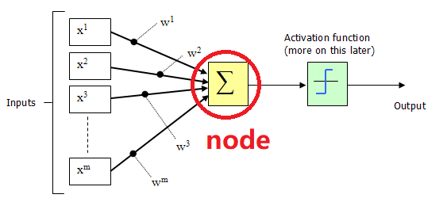

- 神经元之间的连接被抽象为层与层之间（节点与节点之间）计算数据的传递，网络的层数被称为深度。输入输出层外的节点层被称为隐藏层。理论上可以证明，即使是后一层神经元只与前一层神经元相连、后层与前层间没有反馈的简单结构下（前馈神经网络，Feedforward Neural Network），只要节点数量足够，一个两层的神经网络也可以拟合一切数学函数。

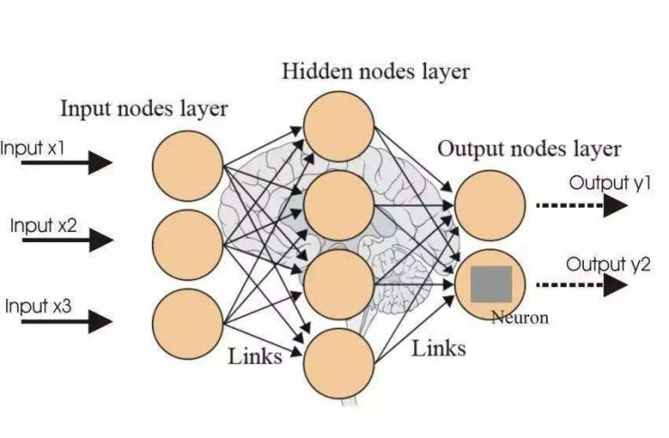

## 卷积神经网络与 AlexNet

通过仿照与抽象生物的视知觉 (visual perceptual) 结构，研究者们提出了卷积神经网络 (CNN, Convolutional Neural Network)，它是一种包含卷积运算的深度前馈神经网络。其结构上的独特设计使得它在信息提取与优化计算性能上优势明显，被广泛应用于图像处理等领域。

AlexNet 属于深层卷积神经网络， 2015 年在 ImageNet 图像识别挑战赛中大放异彩，点燃了研究者们对于深度神经网络算法的热情，在人工智能的发展历程上具有里程碑意义。

区别于此前的神经网络架构，AlexNet 有如下特性：

|        算法        |           作用           |
| :----------------: | :----------------------: |
|  ReLU & 多个 GPU   |       提高训练速度       |
|      重叠池化      | 提高精度、不易发生过拟合 |
|     局部归一化     |         提高精度         |
| 数据扩充 & Dropout |        减少过拟合        |

## AlexNet 原理

### 损失函数

训练神经网络本质上是一个拟合最优化问题。 我们的目标是调整神经网络中的参数，使得网络模型根据输入数据得出的输出结果满足我们的预期要求。为了衡量实际结果与理论预期的偏差，我们引入损失函数 (Cost/Loss function) 的概念。实际中损失函数可以根据数据特点采取均方误差、交叉熵等多种形式。定义了损失函数之后，我们将神经网络的优化问题转化成了寻找损失函数的最小值点问题。

### 矩阵的卷积

在高等数学中，我们学过，函数 $f(x)$，$g(x)$ 的卷积运算为：

$$
f(x)*g(x)= \int_{-\infty}^{\infty} f(x-t)g(t)dt
$$

其中 $g(x)$ 可以称为该卷积运算的卷积核 (kernel)。

由于图像在计算机内部以矩阵形式存储，下面我们考虑卷积运算的矩阵形式。以下图为例，直观表示矩阵卷积的过程：$k \times k$ 大小的卷积核矩阵与 $m \times n$ 大小的输入矩阵进行对应位相乘并求和，得到的结果作为新矩阵中的一个元素。

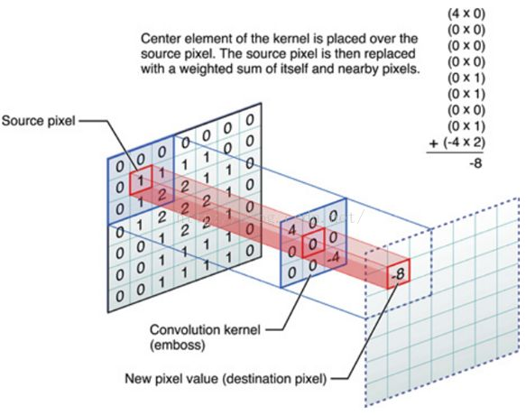

卷积运算的功能是对图像进行信息的提取。

我们可以看到，卷积核每次作用于输入图像上的一个局部区域（被称为感受野）进行运算，可以理解为将该局部位置的特征积累起来得到一个特征值。显然，不同大小、数值的卷积核，提取到的特征也是不同的。通过调整卷积核的大小、数值等参数，我们可以控制对图像特征提取的偏好，达到筛选特征进行分类的目标。

### 矩阵的池化

池化常是卷积的下一步，也是一种矩阵运算。其目的是通过只保留主要特征、忽略次要特征减少数据量，优化计算复杂度。池化有重叠池化 (overlapping pooling)、最大值池化 (max pooling) 等方式。

以 “最大值池化” 方式为例，如下图，将一个 $4 \times 4$ 大小的中间结果矩阵，通过对每个子矩阵取元素最大值，压缩为一个 $2 \times 2$ 大小的矩阵进行后续运算。

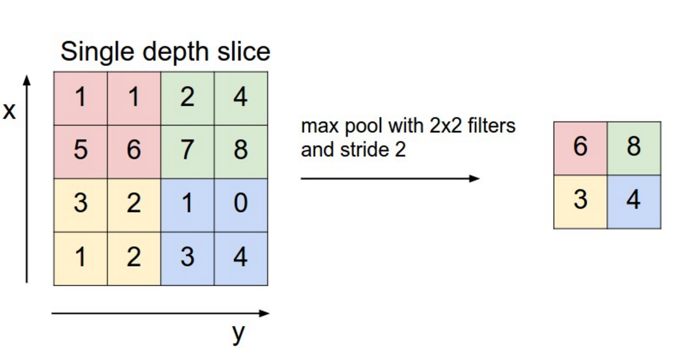

### 全连接层

第一个全连接层把前层得到的特征全部整合起来。

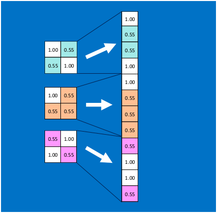

全连接层与全连接层之间的“神经元”两两相互连接，形成一个密集的数据传输网络，参数量很大。


全连接层的存在可以排除特征所在空间位置对特征识别结果的干扰，提高模型的鲁棒性。但是全连接层的参数量过大，实际应用中，也有其他替代全连接层以减少参数量的方法。面对过多的连接数目，减少全连接中的某些边亦可以给防止过拟合一种思路，下面会有提到。

### Softmax 归一化

Softmax 被用于接收来自全连接层的输入，产生最后的结果。以图像分类问题为例，最终的结果是各个可能类别的概率：

$$
\textrm{Softmax}(x_i)=\frac {e^{x_i}} {\Sigma_{j=0}^n e^{x_j}} \in [0,1]
$$

一种方便的而不影响原则的简化是将底数从 $e$ 变为 2，即：

$$
\textrm{Softmax}^{*}(x_i)=\frac {2^{x_i}} {\Sigma_{j=0}^n 2^{x_j}} \in [0,1]
$$

**这样求幂可以通过移位实现，这是本小组进行的简化之一。**

### 前向传播与反向传播

在两个全连接层，计算该层输出结果使用如下前向传播公式：

$$
L_{i+1} = W_iL_{i} + b_i
$$

对于 ReLU 和 Softmax 层，函数作用在矩阵上的方式为作用在矩阵的每个元素上。

反向传播算法基于简单的梯度下降法。根据微积分场论，函数梯度的逆方向是函数值下降最快的方向。因此，对需要调整的参数 W，若我们能够求出损失函数关于当前 W 的偏导数值, 并人为设定基于该偏导数的梯度下降步长 $\eta$（称为学习率），可由下公式得到更新后的 W:

$$
 W^{'}= W-\eta\times\frac {\partial f_{\textrm{Loss}}} {\partial W}
$$

梯度下降直观过程如下图。类似一步步走下山坡直到最低点（存在的问题是得到的目标点有可能是极小值点而非最小值点）。

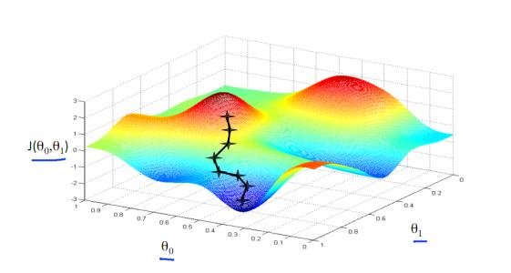

#### 梯度的计算

输入数据以及在 L1、L2 两层的权重和偏置，用矩阵表示如下：

$$
\begin{cases}
W(\textrm{weight})=\begin{pmatrix}
w_{11} & w_{12} & \cdots w_{1n}\\
w_{21} & w_{22} & \cdots w_{2n}\\
\vdots && \vdots\\
w_{m1} & w_{m2} & \cdots w_{mn}\\
\end{pmatrix}\\[5ex]
x(\textrm{input})=\begin{pmatrix}x_1\\x_2\\\vdots\\x_n\end{pmatrix}\
b(\textrm{bias})=\begin{pmatrix}b_1\\b_2\\\vdots\\b_m\end{pmatrix}\end{cases}
$$

输出层结果可以表示为：

$$
 \begin{cases}S(\textrm{softmax layer}) = \textrm{Softmax}(W_2 \cdot (\textrm{ReLU}(W_1 \cdot x + b_1) + b_2) \\[2ex]\textrm{Loss} = -\ln(\frac{e^{S_i-t}}{\Sigma_{i=0}^{n}e^{S_i-t}}|i = \textrm{Label}), \ N=1 \\[2ex]t=\max\{ {S_i}\}\end{cases}
$$

计算每层输出对于输入的梯度：

$$
\begin{cases}
\nabla_S \textrm{Loss} = 
\begin{pmatrix}
\frac{\partial \textrm{Loss}}{\partial S0}\
\frac{\partial \textrm{Loss}}{\partial S1}
\end{pmatrix}
=
\begin{pmatrix}
-\frac{1}{S0}\
-\frac{1}{S1}
\end{pmatrix}
\\[2em]

\nabla_{L_2} S = 
\begin{pmatrix}
\frac{\partial S_0}{\partial L2_1}\
\frac{\partial S_0}{\partial L2_2} \\
\frac{\partial S_1}{\partial L2_1}\
\frac{\partial S_2}{\partial L2_2}
\end{pmatrix}
=
\begin{pmatrix}
\cdots
\end{pmatrix}
\\[2em]

\nabla_{\textrm{ReLU}} L2 = 
\begin{pmatrix}
\frac{\partial L2_1}{\partial \textrm{ReLU}_1}\
\frac{\partial L2_1}{\partial \textrm{ReLU}_2}\
\frac{\partial L2_1}{\partial \textrm{ReLU}_3}\\
\frac{\partial L2_2}{\partial \textrm{ReLU}_1}\
\frac{\partial L2_2}{\partial \textrm{ReLU}_2}\
\frac{\partial L2_2}{\partial \textrm{ReLU}_3}
\end{pmatrix} \\[2em]\nabla_{L_{1}} \textrm{ReLU} =\begin{pmatrix}1 \ 1 \ 1\end{pmatrix}\\[2em]\end{cases}
$$

由链式法则：

$$
\frac{\partial \textrm{Loss}}{\partial LP_{ij}} = \frac{\partial \textrm{Loss}}{\partial L_i} \cdots \frac{\partial L_j}{\partial LP_{ij}}
$$

这样可以得到偏差对于每层输入的梯度表达式。

#### 更新参数

$$
LP_{ij}^{\textrm{new}} = LP_{ij} - \eta \cdot \frac{\partial \textrm{Loss}}{\partial LP_{ij}}
$$

其中 $\eta$ 为学习率。

## AlexNet 的实际结构与简化结构

### AlexNet 的实际结构与实现它的极大困难

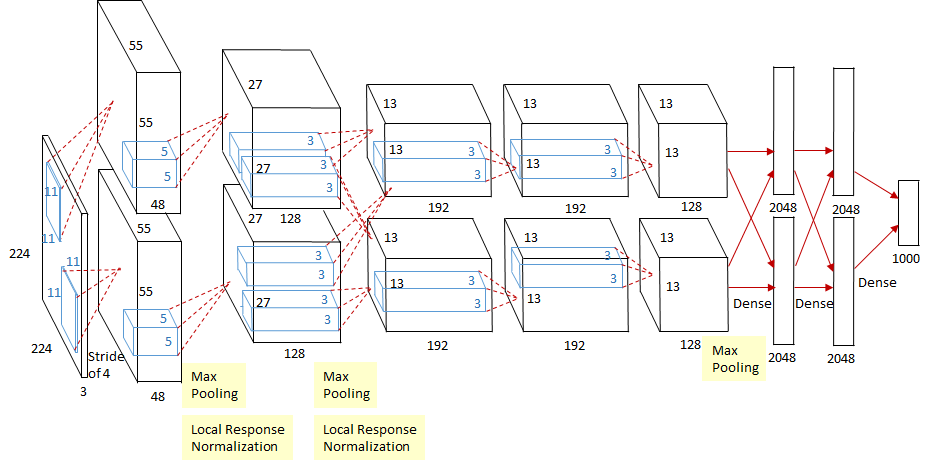

上图是 AlexNet 的综览图。

AlexNet 共有 8 层，前 5 层为卷积（含池化）层，后 3 层为全连接层。

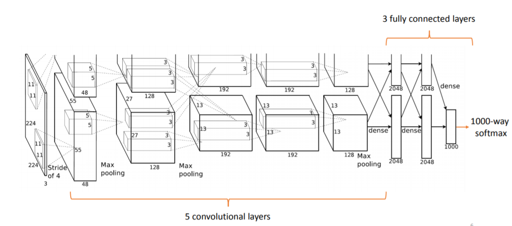

各层的参数数量如下图：

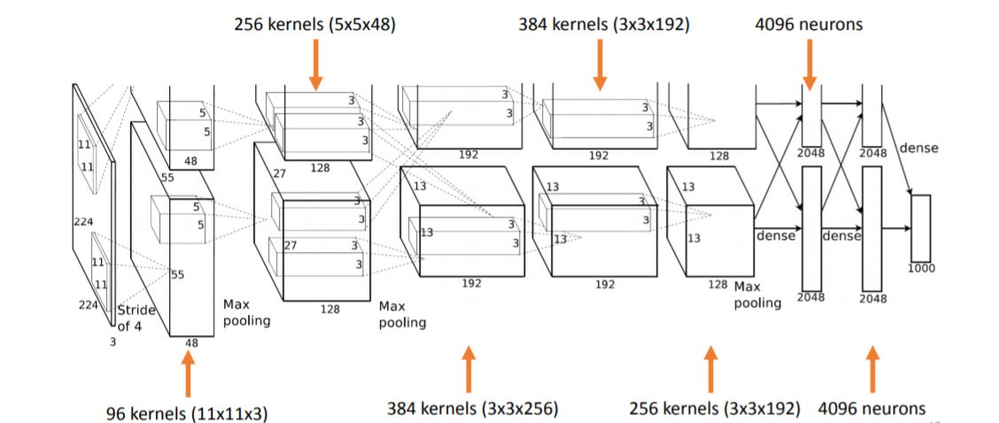

AlexNet 使用 ReLU 作为神经元的激活函数：

$$
\textrm{ReLU}(x)=\max(x,0)
$$

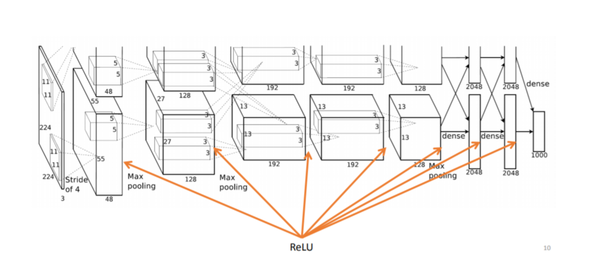

Dropout 是训练神经网络中常使用的防止过拟合的一种 trick（不得不提一下已被 Google 申请专利），原理是在每一次训练中随机选取一部分神经元不参与训练：

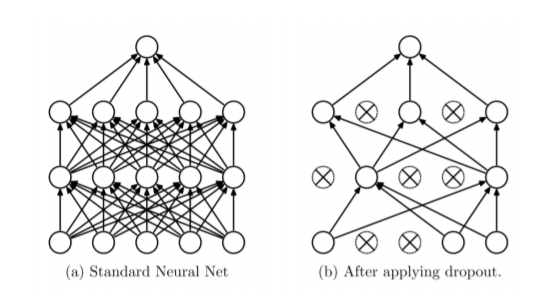

AlexNet 中 Dropout 用在两个全连接层中：

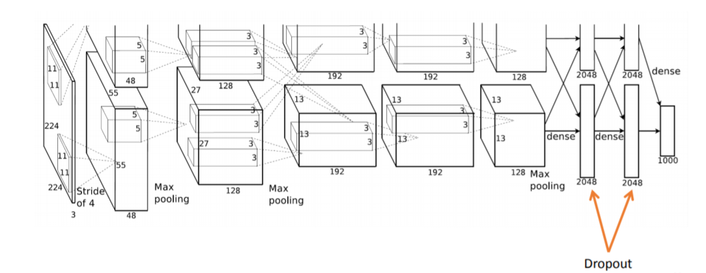

纵览而言，真正在智能网卡上实现一个现实中用双路 GPU 计算的神经网络的困难主要在于：

- 真正的 AlexNet 参数量巨大，约 650K 个神经元，60M 个参数，630M 次连接，复现极为复杂。
- AlexNet 训练过程中使用的 Dropout 实现起来很困难。一种取巧的方式是前层与后层之间共享同样的数据区，前层写数据、后层读数据。由于在智能网卡内，哪个核心（对应这里的神经元）先完成输出运算具有随机性，当一个前层完成其运算输出时，它所占用的核心自动变成后层，此时存储区内有几个可用数据就用几个可用数据。
- 涉及大量矩阵运算。
- 最大的问题是参数的训练：BP 算法涉及到对损失函数求偏导，这在网络比较小时，可以采用提前求好算式把其写在程序里的方式实现，但是网络大时这种方式不可行。
- Agilio SmartNIC 上程序大小受到严格限制，存储能力有限，并且多核间通信以及保持数据一致性是一个很大的问题。
- 需要相对准确的时序控制来保证多个核心之间的正常协作，需要考虑给多核分配不同的任务，并且在合适的时间进行计算与记录。

### 设计 AlexNet 的简化结构

我们的目标是实现一个基础的卷积神经网络，其结构如下：

$$
输入 \rightarrow 卷积层1 \xrightarrow{\textrm{ReLU}} 池化层1 \rightarrow 全连接层1 \xrightarrow{\textrm{Softmax}} 输出
$$


- 损失函数

采用均方误差函数 (Mean Square Error)：

$$
f_{\textrm{Loss}}=\frac {\sum_{i=1}^N(1-S_i|_{i=\textrm{label}})^2} N
$$

其中 N 是一组训练样本 (batch) 的大小。

- Softmax

如前所述，使用 2 代替公式中的 $e$：

$$
\textrm{Softmax}^{*}(x_i)=\frac {2^{x_i}} {\Sigma_{j=0}^n 2^{x_j}} \in [0,1]
$$

则

$$
S_i=\frac {2^{ {W^3_{1i}}L_{21}+{W^3_{2i}}L_{22}+b_{3i}}} {\Sigma_{i=1}^2 {2^{ {W^3_{1i}}L_{21}+{W^3_{2i}}L_{22}+b_{3i}}}}
$$

- 训练方法

  由于网络结构简单，可以由 BP 算法直接写出各参数的更新公式。以全连接层 2 为例：

  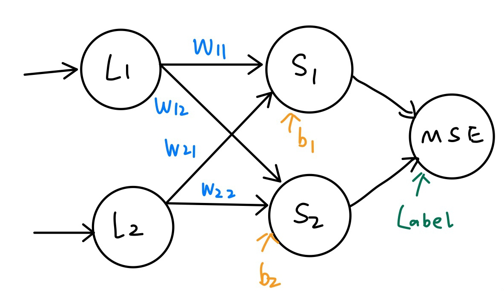

$$
\begin{align}
\frac {\partial f_{\textrm{Loss}}} {\partial \vec W} & =[\frac {\partial f_{\textrm{Loss}}} {\partial W_{11}},\frac {\partial f_{\textrm{Loss}}} {\partial W_{12}},\frac {\partial f_{\textrm{Loss}}} {\partial W_{21}},\frac {\partial f_{\textrm{Loss}}} {\partial W_{22}}]\\
& =\frac {\partial f_{\textrm{Loss}}} {\partial \vec S} \frac {\partial \vec S} {\partial \vec W}\\
& =\frac 2 N \times[n_1\frac {d(1-S_1)} {dS_1},n_2\frac {d(1-S_2)} {dS_2}]\left[ 
\begin{array}{c}
{\frac {\partial S_1} {\partial W_{11}}}& {\frac {\partial S_1} {\partial W_{12}}} &
{\frac {\partial S_1} {\partial W_{21}}} &
{\frac {\partial S_1} {\partial W_{22}}}\\
{\frac {\partial S_2} {\partial W_{11}}}& {\frac {\partial S_2} {\partial W_{12}}} &
{\frac {\partial S_2} {\partial W_{21}}} &
{\frac {\partial S_2} {\partial W_{22}}}
\end{array}
\right]\\

\end{align}
$$

​    采用差分方式代替偏导。并将各参数放大 128 倍以提高精度。

$$
\frac {\partial S_1} {\partial W_{11}}=\frac {S_1(W_{11})-S_1(W_{11}-\Delta W_{11})} {W_{11}-\Delta W_{11}}
$$

​    然后利用梯度下降公式更新参数：

$$
W^{'}= W-\eta\times\frac {\partial f_{\textrm{Loss}}} {\partial W}
$$

### 简化结构的伪代码示例

```c
// 输入：8x8 (每个像素点 0-255, __u8)(只有一层的灰度图)
//  __u8 image[8][8];
// 卷积核，大小暂定 5x5
//  __u8 filter[5][5] = random_initial(); // 随机初始化

// 卷积：
__u8 **Convolution(__u8 *image[], __u8 *filter[]) {
    // 卷积核 大小 5x5，步长 1，这样卷积出来的结果是一个 4x4 的矩阵
    // 卷积核中 25 个参数是要训练得到的

    __u8 conv_result[4][4];
    for (int i = 0; i < 16; i++) { // 卷积核移动 
        // 矩阵乘法
        for (int j = 0; j < 5; j++) {
            for (int k = 0; k < 5; k++) {
                result[i / 4][i % 4] += filter[j][k] * image[i / 4 + k][i % 4 + j];
            }
        }
    }
	return conv_result;
}

// ReLU 激活函数
__u8 **ReLU(__u8 *x[], int n) {
    __u8 result[n][n];
    for (int i = 0; i < n; i++) {
        for (int j = 0; j < n; j++) {
            result[i][j] = (x[i][j] > 0) ? x[i][j] : 0;
        }
    }
    return result;
}

// 池化：AlexNet 中采用最大值池化
// 卷积的结果是一个 4x4 的矩阵，池化后变成 2x2 的
__u8 **Pooling(__u8 *conv_result[]) {
    __u8 pool_result[2][2];
    for (int i = 0; i < 2; i++) {
        for(int j = 0; j < 2; j++) {
            pool_result[i][j] = max(
                conv_result[2 * i][2 * j],
                conv_result[2 * i + 1][2 * j],
                conv_result[2 * i][2 * j + 1],
                conv_result[2 * i + 1][2 * j + 1]);
        }
    }
    return pool_result;
}

// 全连接层, 返回值是一维数组
__u8 *FullConnectLayer(__u8 *pool_result[], __u8 FCL_filter0* [], __u8 FCL_filter2* [], ..., __u8 FCL_filter9* []){
    // 全连接层应该有10个神经元：对应数字识别
    __u8 neuron[10];
    for (int i = 0; i < 10; i++) {
	   neuron[i] = **Convolution(pool_result, FCL_filter{i});
    }
    return neuron;
}

// Softmax 层，输出 0-9 的识别概率
int *Softmax(__u8 neuron[]) {
    int probability[10];
    int sum = 0;
    for (int i = 0; i < 10; i++) {
        sum += exp(neuron[i]); // 需要改成 2
    }
    for (int i = 0; i < 10; i++) {
        probability[i] = exp(neuron[i]) / sum;
    }
    return probability;
}

// 选出概率最大的作为预测结果
int Argmax(int x[], int n) {
    int max = 0, arg;
    for (int i = 0; i < n; i++) {
        if (x[i] > max) {
            max = x[i]; 
            arg = i;
        }
    }
    return arg;
}

int main() {
    // 一张图片
    __u8 image[8][8]; 

    /* input image */
    // 偏置，是不需要训练 (?) 的参数，先设置为 0.1
    __u8 Bias[4][4] = {0.1, ...}; 
    // 学习率，超参数，人为设定，比如说 0.4
    const __u8 eta = 0.4;  
    // 卷积核初始化，可以全赋值为 1
    __u8 filter[5][5] = random_initial();
    __u8 FCL_filter0[2][2], ..., FCL_filter9[2][2] = random_initial();

    // 若对数字识别：result = 0, 1, 2, ..., 9
    // 搭建神经网络：
    int result = Argmax(
                    Softmax(
                        FullConnectLayer(
                            Pooling(ReLU(Convolution(image,filter) + Bias, 4)),
    	                    FCL_filter0, ..., FCL_filter9)), 10
                );

    /* 训练：进行验证，误差反向传播，使用BP算法训练参数 */

    // 误差可以采用均方误差
    // 每训练一组 (batch)，一组 n 张图，计算一次 loss，然后用 BP 算法调参
    double loss = sum((result - true_value) * (result - true_value)) / n;

    // BP 算法，需事先把偏导式写出
    // 这里要调整的参数有：卷积核 5x5=25 + FCL 卷积核 10x2x2=40 =65个参数
    wi -= eta * (A * wi + B * wj + C * wk + ...);  

    printf("Prediction is %d\n", result);
    return 0;
}
```

## AlexNet 简化结构的硬件卸载调研

Agilio CX SmartNIC 上有很多相对独立的流处理核心，可以给每个核心**分配不同的计算任务**，使其充当上述神经网络中某一个节点或者计算对应的梯度，并且给两个隐藏层分配一定的**存储空间**来储存权重矩阵和偏置参数以及中间数据。此外还应有**整体控制模块**，用来发出信号，控制每个核心的工作顺序。计算节点在接收到信号后开始从固定位置获取信息，并完成该节点的计算任务，然后在合适的时间存储，以供下一层节点使用。

整个迭代过程分为输入数据，前向传播，计算梯度，更新参数。其中后面三个阶段均会涉及到多个处理核心之间的通信，以及核与存储之间大量数据读写。

接下来以三个方面叙述调研结果：

### 数据存储与共享

(UG_nfp6000_nfcc.pdf, P37 始) Netronome Network Flow Processor 6xxx（以下简称 NFP）提供的数据存储位置有：

#### 寄存器数据存储

寄存器分为：通用寄存器 General Purpose Register (GPR)；传输寄存器 Transfer Registers (XFR)；邻居寄存器 Next Neighbor Register (NN)；不定寄存器 Volatile Register。

每一个 NFP 支持 256 个通用寄存器，这些寄存器被划分成两个分区 A 和 B，需要注意的是**每个指令周期内只能读取一个分区中的一个寄存器**，如二元运算 ` w = r1 + r2 ` ，若 r1 与 r2 在同一个区，编译器会在编译时隐性增加数据转移指令将其中一个数据先移到不同区。

每个 NFP 还支持 512 个传输寄存器（其中 256 个 Transfer_In registers for I/O，256 个 Transfer_Out registers for I/O）。传输寄存器用来取 Memory（下面介绍）中的数据到寄存器里，亦分为 read XFR (作为 Memory source) 和 write XFR (作为 Memory destination)。

并且每个 NFP 有 128 个邻居寄存器 (NN)。**NN 可以用于两个相邻 NFP 核心之间的通信。是我们需要重点关注的。**NN 有两种工作模式，可以对 CTX_ENABLE CSR 的 NN_MODE 位进行修改：当 NN_MODE = 0 时，核心 A 不能向自己的 NN 中写数据而只能读，但可以向相邻的核心 B 的 NN 中写数据；NN_MODE = 1 时，核心 A 只能读写自己的 NN。

#### 内存 (Memory) 数据存储

Memory分为：每个 NFP 内部的 Local Memory，外部的 SRAM、MEM（包含 IMEM，EMEM 和 CTM）、Cluster Local Scratch (CLS)。

Local Memory 是每个 NFP 所私有的，大小为 1024 longwords。

**特别地，如果 C 代码试图读写内存，SDK 编译器将自动保证数据的同步一致性。**

编程者可以使用 `__deslspecs` 语句指定程序中数据存放的位置。

整个网络的数据包含两个主要部分：权重、偏置等参数（大型矩阵）以及当前正在计算的中间结果、梯度（向量）。前者需要更多的存储空间（MB 级别），并且在每次反向传播完成后才会修改。因此，将权重、偏置等参数存放在外部的 Adaptive Memory 中，而当前正在计算的数据记录在寄存器中。

官方文档 (“Microcode Standard Library Reference Manual”) 提供有 `buf_alloc()` 和 `buf_free()` 函数，可以在程序内分配和释放 S/DRAM 的存储空间。以及控制 sram 读写的以及直接对存储内容增减的函数，包括 `sram_read()` 、`sram_write`、 `sram_bits_clr()` 、`sram_bits_set()`、 `sram_add()` 等（见文档 2.24）。此外还提供了实现队列的一系列函数。

#### 核心之间数据的共享和同步

在我们的简化 AlexNet 设计里，多个计算核心之间需要进行通信，比如下图中：$L_{11}$ 节点与 ReLU 节点需要通信。


每个圈代表的过程或神经元都被分配一个核心。核间通信的设计如下图：

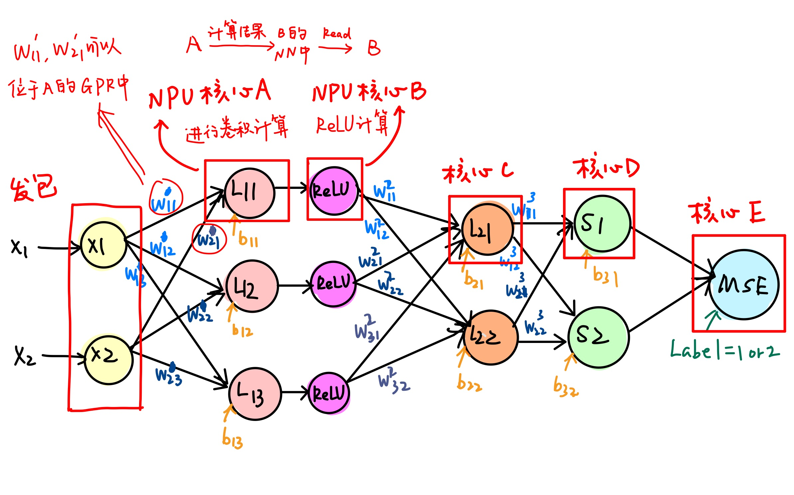

使用的通信技术包括 Next Neighbor Register，以及一种名叫 Reflector 的运算 (UG_nfp6000_nfcc.pdf, P46)

进一步分析简化设计中的特点，$(w _ {11}^{1}, w^1 _ {21}, b _ {11})$ 这三个参数可以存储在核心 A（$L _ {11}$ 节点）的 GPR 中，因为这三个参数并未被其他节点所使用。

但我们依旧需要控制各个核心计算的先后顺序——这是 AlexNet 不同层的先后顺序。**SDK 允许我们编程信号量和信号**，包括：

- Signals (UG_nfp6000_nfcc.pdf, P46)
- Semaphore Library (UG_nfp6000_nfcc.pdf)

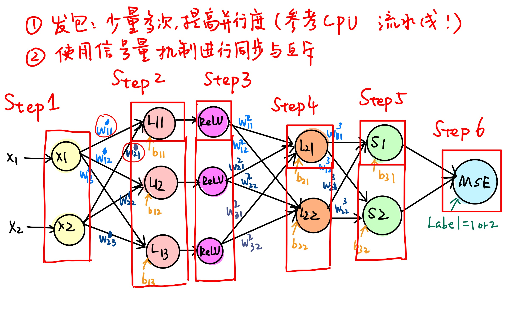

### 数据运算

矩阵运算是 AlexNet 中的最大最多的运算，其次还包括 Softmax 函数的指数运算、高精度除法和大规模的累加。指数运算已经通过修改底数为 2，并用移位代替乘法来解决了。最复杂的是矩阵运算，而不幸的是，SDK 文档并没有提供专门针对矩阵运算的函数，但仍旧可以在一些层面关注矩阵乘法的加速，首先是乘法运算本身：

#### 乘法内置函数

根据 Micro-C 标准库文档 (RM_nfp6000_microclib.pdf, P690 始)，可以使用如下 intrinsic function（内置函数）在 Netronome Network Flow Processor 6xxx 实现 16 位乘 16 位数的乘法运算：

```c
unsigned int multiply_16x16(unsigned int x, unsigned int y)
```

也可以实现 32 位乘 32 位的乘法运算：

```c
// 取低32 bits
unsigned int multiply_32x32_lo(unsigned int x, unsigned int y)

// 取高32 bits
unsigned int multiply_32x32_hi(unsigned int x, unsigned int y)
```

例：

$$
y_1=w_1\times x_1+b_1\\
y_2=\textrm{ReLU}(y_1)
$$

```c
__declspec(gp_reg) unsigned int y1, y2, w1, b1;

y1 = multiply_16x16(w1, x1) + b1;

y2 = (y1 > 0) ? y1 : 0;
```

#### 多个流处理核心加速矩阵乘法

考虑利用硬件结构进行矩阵乘法的优化。注意到多个流处理核心可以并行工作而且计算完成后的到的是一个 $n \times 1$ 的向量，因此可以并行计算矩阵乘法中每行的乘加计算，并直接存放到向量中元素对应位置，从而实现时间复杂度为 $O(n)$ 的矩阵乘法。

#### 对数运算和除法运算

Microcode Standard Library Reference Manual 文档 2.15 提供了相应的除法和对数运算 `math_log2(out_result, in_arg, IN_ROUND)`, `math_int_div(out_q, in_numerator, in_denominator)`。

### 多核心协作机制

我们的 AlexNet 简化设计图上只有寥寥几个核心，而整个网卡有 60 个核心可供使用。若想充分利用多个核心性能，需要同时处理不同计算任务，因此要考虑将多个线程分配给不同的核心处理，这就涉及到多个线程的同步、互斥，并且需要有一个主控程序控制算法整体的运作。

注意到整个算法包含了前馈和反馈两个相互独立的阶段，需要进一步考虑是主控制程序仅负责时序控制，即事先给每个核心分配单一任务，仅在合适的时间开始执行计算任务；还是由主控制程序动态分配每个核心执行的任务，并且负责数据收集和存储。

文档在 2.25 给出了线程同步的机制和相关函数，可以在后续尝试中选择合适的实现方式。

## 项目总结

本⼩组的项⽬选题接受了邢凯⽼师的建议，使⽤⼀个全新的、⾏业内领先⽽资料并不⻬齐备的硬件——可 编程智能⽹卡——来尝试对冯诺依曼体系结构处理数据流的过程进⾏⾮冯化改造。项⽬过程中收获颇丰，接触到了数据流计算体系、硬件卸载等之前生疏的领域。

完整的深度卷积神经网络 AlexNet 实现复杂性复杂性较大，且因为疫情原因有所耽搁。本小组最终只针对 $8 \times 8$ 的灰度图进行简化的AlexNet 的设计与实现调研。

为了充分利用 60 个 NPU 计算核心，除了必定映射到神经网络节点的一部分以外，其他核心应依照多核心协作设计方式，用于处理诸如 ReLU 等 AlexNet 中特定的过程，或者加速梯度下降、矩阵乘法等允许分块处理的计算过程。

为协调各个核心之间的计算任务，必需要进行数据共享和同步。NFP 内部有独占的通用寄存器和专为相邻核心通信使用的相邻寄存器以及内存传输用的传输寄存器。同时，网卡内有供各个 NFP 独占的或允许共享访问的大存储区域，编程者可以使用特殊命令指定变量或数组的存放位置，而编译器会尽可能保证对内存读写的同步。

针对数据传输的先后顺序，保证后使用数据的核心在前一层输出未计算好之前不执行，需要诸如信号量等机制进行互斥与同步操作。编译器提供了这些方式。

针对部分诸如对数、乘除的数据运算，有专门的内置函数可供调用，而有些像矩阵乘法等大型计算过程需要其他方式的优化。

最终的多核心协调可以设计一个主控核心执行主控程序，使用状态机等方式，读取各个核心发来的 signal 信号函数，控制整体工作。

# 致谢

？？？？？？

# 参考文献

1. [UG_Getting_Started_with_eBPF_Offload.pdf](https://github.com/OSH-2019/x-monthly-subscription/blob/master/resources/UG_Getting_Started_with_eBPF_Offload.pdf)
2. [ImageNet Classification with Deep Convolutional Neural Networks](https://www.nvidia.cn/content/tesla/pdf/machine-learning/imagenet-classification-with-deep-convolutional-nn.pdf)
3. [实例详解神经网络的back propagation过程](https://software.intel.com/zh-cn/articles/step-by-step-explaination-on-neural-network-backward-propagation-process)
4. [多类别神经网络 (Multi-Class Neural Networks)：Softmax](https://developers.google.com/machine-learning/crash-course/multi-class-neural-networks/softmax)
5. [ImageNet](https://www.jiqizhixin.com/articles/2017-07-27-2)
6. AlexNet 结构：
   1. <http://cvml.ist.ac.at/courses/DLWT_W17/material/AlexNet.pdf>
   2. <http://vision.stanford.edu/teaching/cs231b_spring1415/slides/alexnet_tugce_kyunghee.pdf>
7. 全连接层：<https://zhuanlan.zhihu.com/p/33841176>
