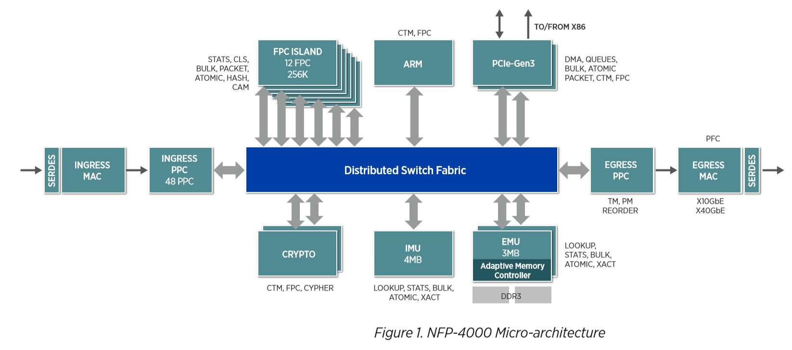
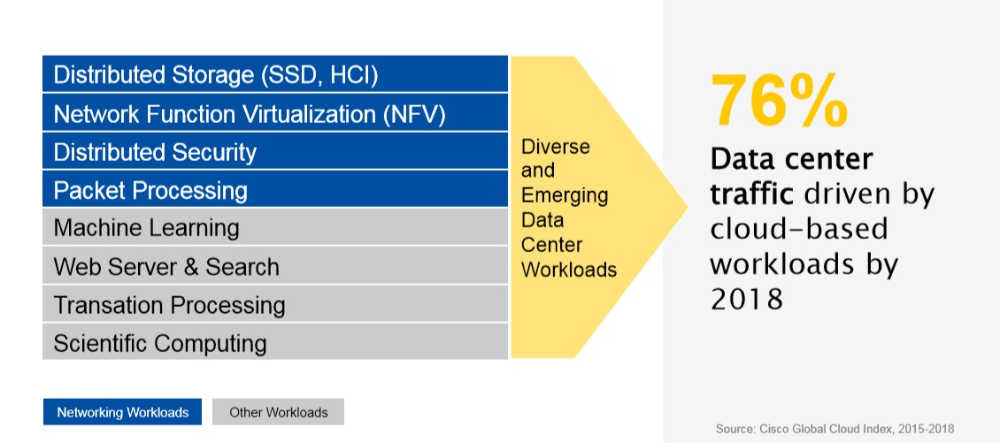
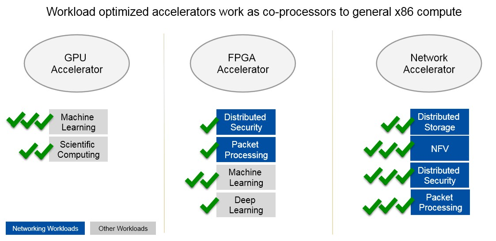
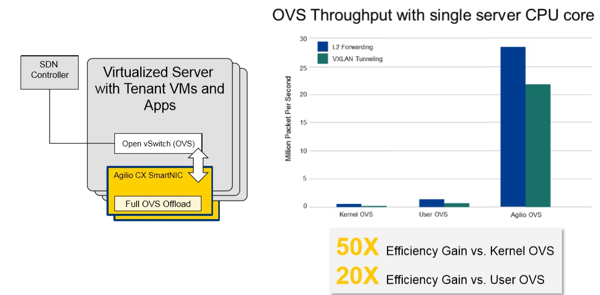
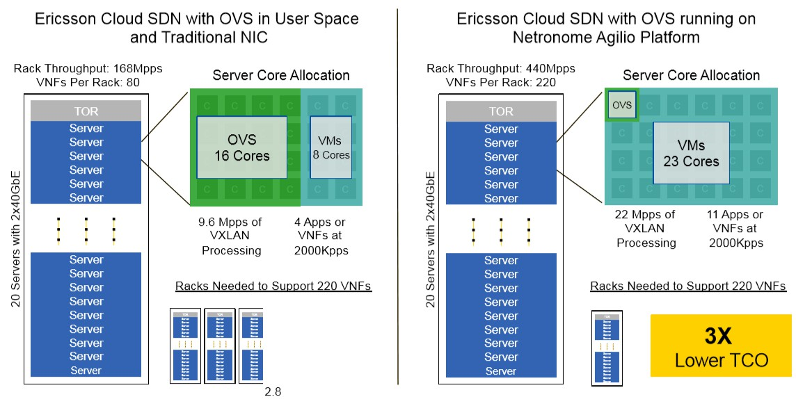

## 概要

> - 当前使用数据流架构（如本实验使用的 SmartNIC 系列），诸如数据中心和云服务提供者，它们在此网卡的协作下将网络效果提高了多少。等等涉及 SmartNIC NFP 的性能表现，优化等级，延迟降低到什么级别，速度提高到什么等级，等等。
> - 当前 eBPF 从 C / P4 高级语言编写到生成 eBPF 字节码的整个过程，各个步骤的可以展开的细节（cLang 做了什么，LLVM 做了什么等等），一步步往下的图解，到硬件卸载翻译成硬件的指令（包括本地CPU 和 SmartNIC ）之前经过 JIT ，JIT 是什么（一些概念和解读细节等）。
> - 本实验使用 SmartNIC 对 eBPF offload 的支持，所提供的工具链，添加一些能查到总结到的资料扩展一些细节等等。

### 智能网卡 SmartNIC

#### 产生

现代的工作负载和数据中心设计给CPU核心带来了太多的网络开销。随着更快的网络速度(每个链接可高达200Gb/s)， CPU花费了太多开销对网络流量进行分类、跟踪和控制。这些昂贵的CPU内核是为通用应用程序处理而设计的，而不是消耗所有这些处理能力仅用来查看和管理数据的移动。

智能网卡（SmartNIC）应运而生，它可以将本应由CPU处理的工作转移到网卡上执行，减少CUP工作量的同时提高性能，其核心是通过FPGA(现场可编程门阵列)协助CPU处理网络负载，编程网络接口功能，具有以下特征：

* 通过FPGA本地化编程支持数据面和控制面功能定制，协助CPU处理网络负载；

* 通常包含多个端口和内部交换机，快速转发数据并基于网络数据包、应用程序套接字等智能映射到到相关应用程序；

* 检测和管理网络流量。

过去30年来，网卡已经从具有单一MAC，PHY和系统接口的简单网卡发展到具有一个，两个或更多网络接口和用于TCP/IP的硬件卸载引擎的高性能适配器、虚拟化等功能。最新的NIC基于支持10Gbit/s，25Gbit/s，50Gbit/s或100Gbit/s网络接口的输入/输出(I/O)控制器。Smart NIC将FPGA、处理器或基于处理器的智能I/O控制器与分组处理和虚拟化加速集成在一起。大多数Smart NIC可以使用标准的FPGA或处理器开发工具进行编程，越来越多的厂商也开始增加了对eBPF以及可编程语言P4的支持。

目前业界提供基于FPGA的Smart NIC的厂商包括Accolade、BittWare、Enyx、Ethernity、Napatech、Netcope、Reflex CES、Silicom和Solarflare。这些适配器集成了来自Intel或Xilinx的FPGA，其中一些采用了最新的Stratix 10和UltraScale + FPGA的FPGA。基本的I/O控制器功能是使用FPGA实现的，或者由单独的I/O控制器进行处理。Broadcom，Cavium，Intel，Kalray，Mellanox，**Netronome**，Silicom和SolidRun均可提供基于处理器的Smart NIC。Smart NIC使用带有集成处理器内核或可编程交换的处理器或智能I/O处理器，亚马逊和谷歌已经开发了自己的Smart NIC ASIC。

#### 应用场景

+ 安全隔离

出于安全性考虑，有时需要将网络与 CPU 相隔离，通常黑客攻击和恶意软件来源于网络。使用智能网卡便可以在网卡上检查网络流量、阻止攻击和进行加密传输，从而带来了性能和安全性的提升。如果主CPU受到威胁，那么智能网卡仍然可以检测恶意活动，在不立即占用CPU的情况下阻止攻击。

+ 存储虚拟化和云

智能网卡的一个较新的用例是虚拟化软件定义的存储，超融合基础架构和其他云资源。在超融合架构数据中心中，Smart NIC为虚拟化应用程序提供硬件加速与网络接口紧密结合，并可分布在大型服务器网络中，减小CPU负载，提供额外的边缘计算能力，加速特定应用和虚拟化功能，并且通过正确的语言和工具链支持，为用户提供应用加速即服务的附加价值。智能网卡甚至可以虚拟化GPU（或一些神经网络处理器），以便任何服务均可通过网络访问[^1]

一个好的智能网卡必须是可编程的。虽然为了获得最佳性能，大多数加速功能必须在硬件中运行，但为了获得最大的灵活性，这些功能的控制和编程需要在软件中运行。

有许多功能可以在智能网卡上编程，通常，特定的卸载（offload）方法，加密算法和传输机制不会发生太大变化，但路由规则，加密密钥和网络地址始终会发生变化。我们将前者的功能视为数据面，后者则用作控制面功能。一旦建立标准化，数据面规则和算法就可以编写到硬件上了。然而控制面规则和编程变化多样，无法硬编码到芯片中，但可以在FPGA上运行或在C可编程的Linux环境中运行。

#### Agilio SmartNIC

我们计划使用 **Agilio CX SmartNIC 2x10GbE**[^2] 这款智能网卡来实现 eBPF offload 的**相关功能**。

其核心部件为**NFP (Network Flow Processor)**，它是一个多线程多核的网络流处理器，相关参数如下[^3]：

它拥有60个流处理核可以支持我们使用 BPF/eBPF offload，具体流程如下图所示：

### BPF 衍生应用

BPF（Berkeley Packet Filter）这一概念提出于1992年，最初是一种过滤数据包并避免从内核到用户空间的无用数据包副本的方法。后来在2013年 Alexei Starovoitov 彻底重塑了它，开始添加新的功能（如映射、尾调用等）并改善 BPF 的性能。这个新版本被称为 **eBPF**（extended BPF），而前者则变为cBPF（classic BPF）。同时 JIT（Just-In-Time） compiling machine 也被重写，使得eBPF甚至比cBPF更贴近本地机器语言。eBPF后来被应用在网络编程中。除了套接字过滤器，eBPF程序还可以附加到TC（Linux Traffic Control Tool）的出入接口，并以有效的方式执行各种数据包处理任务。[^4]

#### eBPF

eBPF(extended Berkeley Packet Filter)，自2014年引入Linux内核以来，已经迅速被许多系统所采用，包括网络监控、网络流量操作和系统监控等，所有这些都可以通过Agilio CX SmartNIC编程和卸载方法来加速。

eBPF以多种方式扩展了经典的BPF虚拟机，引入了以下概念：

+ 与x86-64类似的架构：BPF使用64位寄存器，并将可用寄存器的数量从2（累加器和 X 寄存器）增加到10。 eBPF还扩展了操作码的数量。
+ 与网络子系统分离： BPF受限于基于数据包的数据模型。由于它用于包过滤，因此其代码存在于网络子系统中。但是，eBPF VM不再受限于数据模型，它可以用于任何目的。现在可以将eBPF程序附加到跟踪点或 kprobe 中。这为eBPF打开了插桩（Instrumentation），性能分析以及其他内核子系统中的更多用途的大门。
+ 全局数据存储（Map）：Map是一种通用数据结构，以键值对的形式存储不同类型的数据。它们允许在eBPF内核程序之间以及内核和用户空间应用程序之间共享数据。
+ 辅助函数（Helper functions）：如数据包重写，校验和计算或数据包克隆。与用户空间编程不同，这些函数在内核中执行。此外，还可以从eBPF程序执行系统调用。
+ 尾调用（Tail-calls）：eBPF程序限制为4096字节。尾调功能允许eBPF程序通过控制新的eBPF程序，克服此限制。[^5]

### SmartNIC 中的数据流结构

我们使用的智能网卡中的核心部分是型号为 NPF-4000 的网络流处理器，有别于为一些通用服务器提供的高性能处理，它可以用来提供高速的网络包处理。他拥有高度并行处理能力，并且有在纳秒级的上下文切换速度，下图是这款网络流处理器的微结构示意图：

#### 流处理核心 (Flow Processing Cores - FPCs)

如上图所示，NFP-4000 有 60 个流处理核心，他们被分组成多个集群，并且分布在多个岛（Island）上，这些核心都是 32 位的定制核，并且每一个核能同时支持八个线程，使得这款处理器最多可以同时处理 480 个数据包。此外，每个流处理核心都连接了大量通用寄存器，并拥有访问专用指令和数据内存的权限，这使得他们可用来减少一些典型的输入输出指令、访问内存指令的延迟。高度并行的特点使得多个线程可以同时运行，从而减少内存延迟的影响。

此外，它提供了硬件加速器，可以将一些简单的工作从 FPC 中分散到其他功能部件中以缩短 FPC 的指令周期。可以被加速的功能包括数据包修饰、统计引擎、负载平衡和流量管理等。

最后，整个架构通过高性能分布式交换结构（Distributed Switching Fabric）连接，该结构在设备中的所有组件之间提供高带宽的网络状连接使得各部件间能有效协作。

#### 性能

目前，智能网卡已经被应用到多个领域，如：数据中心中如分布式内存、网络虚拟化，网络包处理等占据 76% 工作量的任务可以使用智能网卡提升处理速度

显著提高 OVS（Open vSwitch - 开放虚拟交换）效率

爱立信云 SDN（一种网络虚拟化解决方案，可为基于虚拟，物理和容器的工作负载提供无缝的内部和数据中心间连接）的服务器吞吐量提升和成本减小：

### SmartNIC对eBPF硬件卸载的充分支持

我们将要使用的SmartNIC已经对eBPF的硬件卸载从硬件到软件做了充分的支持。

#### SmartNIC 上 ebpf hardware offload 流程

1. 编写程序并获得eBPF字节码：将写好的C语言程序通过eBPF的clang与LLVM后端将C程序编译成eBPF字节码(Bytecode)，得到elf文件。

2. 加载入内核：然后通过调用bpf() 系统调用将程序加载到内核中。当程序要被硬件卸载时，我们需要向系统调用传递一个额外的接口索引，以指示将要卸载的设备。

3. 验证安全性（Verify）：因为eBPF 的代码是跑在内核空间中的，为了保障内核的正常工作，该程序在内核中将会被Verifier验证，确保这个程序一定会终止，不会出现死循环，并且没有任何其他安全问题，

4. 使用JIT将eBPF字节码编译成本机指令

5. 硬件卸载（offload）： 包含maps offload 和program offload。

***下面对SmartNIC是怎样支持流程中的每个环节进行展开.***

   

#### 1.SmartNIC 对编程、调试工具链的支持

1. Netronome 提供了bpftool，这是一个重要的调试bpf程序、监视maps内容的工具。能让我们更好地开发bpf程序并卸载到SmartNIC上。

   其具有方便用户检查maps中数据结构内容、易于安装***（***、目前仍在不断更新改进***）******（这算优点嘛？？？）***等优点。

2. [Netronome的Agilio eBPF支持网站](https://help.netronome.com/)还提供了在 CX SmartNIC（即我们使用的型号）上运行卸载的BPF程序所需的 Agilio BPF 固件等。

3. Netronome 提供了完备的工具链：Software Development Kit（SDK）
   它包含编译器，连接器以及能够精确到到指令周期时间的模拟器（cycle accurate simulator），并将它们集成到了一个综合的开发环境中。SDK 在 Window 平台上有图形化开发环境，在 Linux 平台上可以通过命令行使用。使用 SDK ，我们可以直接使用 C 语言直接对 SmartNIC 进行编程。

​     上图中，我们可以使用 Network Flow C Compiler，这是是一个经过优化的、适配数据流架构的 C 编译器，并为 C 语言提供了一些扩展语法（extensions）。

​     使用 SDK（Software Development Kit）IDE 的完整开发流程：

#### 2. SmartNIC 硬件架构对 maps offload 的支持：

***BPF maps***：

eBPF maps的功能是：在不同的ebpf程序之间、bpf程序与内核程序之间、bpf程序与用户程序之间共享数据，还可以用于记录bpf程序的状态。maps可以理解成是各种程序之间实现通信的一种十分重要的方法。

maps就是一个键值对，它的数据结构是任意的。常用的两种是哈希表maps和数组maps。

maps只能由用户空间中的程序通过bpf系统调用来创建，一个用户程序能够创造多个maps，并通过file descriptors去访问它们的内容。用户程序与ebpf程序都能够更改储存在maps中的内容，而且不同的ebpf程序能够并行访问同一个maps。

------

为了保持ebpf在offload之后仍能有优秀的实时处理性能，maps可以同样offload到SmartNIC上。

并且maps在offload之后仍然可以被host程序访问，SmartNIC对ebpf maps offload的支持体现在以下几点：

1. 用户程序可以在用户空间读取maps内容，用于调试或者收集数据等
2. 用户程序可以在用户空间修改maps中存储的数据，比如设置ebpf程序在运行时要使用的参数，如需要阻塞的ip地址的列表等。
3. 硬件卸载后的ebpf程序可以读取maps中的值，比如说需要从中读取一些必要参数等（table lookups）
4. 硬件卸载后的ebpf程序可以修改maps中的值。因为这涉及到ebpf程序之间的同步问题，一般情况下需要引入锁，为了提高并发性，SmartNIC提供了一种特别的“写入”原子操作，更快而且更有用。

目前SmartNIC已经支持最常用的数组maps和哈希maps，可以说maps offload的功能已经很齐全并且高效。

下图：Map Offload

#### 3. SmartNIC 架构对 bpf helper function 的支持

***helper function***：

cbpf和ebpf的区别之一就是ebpf程序可以在运行中调用helper functions而cbpf没有这种机制。

bpf helper function 是一类在内核中定义好的函数，bpf程序可以实时调用它们。这些helper functions可以理解成接口，为ebpf程序与内核交互、与它们工作的上下文交互提供了方便。例如，helpers可用于打印调试消息、获取系统时间、与eBPF maps交互、操纵网络数据包等。

------

SmartNIC当然也对helpers提供了必要的支持，并且提供了device-spcific的helpers实现。卸载后的bpf程序可以通过特殊的maps与这些helpers 交互，提高数据处理的效率。

#### 4. Netronome 对 eBPF JIT 编译器的优化：

   最新发布的 eBPF JIT compiler 已经可以支持间接逻辑移位与

等少数在过去不能被编译的 bpf 指令，同时 JIT 还可以检查一段指令序列中是否存在可以优化的部分，从而将原指令转化成另一端在机器执行中性能更好的指令。目前 JIT 仍在不断改进，有望在未来实现对以下功能更好的支持：

- 能够减少最终程序中的指令数量，以获得更好的性能或支持更高的指令总数。
- 能够通过支持在硬件上执行速度更快的指令来提升程序性能。
- 能够优化资源使用，例如在堆栈中使用的内存。

### 使用SmartNIC与NFP实现纳秒级相应时间的可行性

上图: SoC Architecture-Conceptual Components

1. 在传统通用服务器处理器上提升性能的方法已不再适用于现代高速网络包处理。数据中心的网络包处理需要纳秒级的上下文切换速度与极高的并行程度。为了解决这一问题，NFP-4000 使用了高度并行化的数据流处理核心（FPCs: Flow Processing Cores）， 这些FPC是专门为基于数据包和流的处理而构建和优化的。NFP-4000最高支持60FPCs，每个FPC可以支持8线程，因此，NFP-4000可以最多同时处理480个网络包，有着巨大的吞吐量与高效的处理能力。

2. 内存：NFP-4000支持以分层方式组织多个存储器单元。 内部存储器单元（IMU）支持4MB SRAM，外部存储器单元（EMU）支持3MB的SRAM。 每个存储器单元都支持专用的硬件加速器来提供强大的数据包流处理功能。

### Agilio CX 2x10GbE 的优势

1. 高效处理能力： Agilio CX SmartNIC是专门为解决现代网络包数据处理问题而设计的，通过有效地硬件卸载虚拟切换过程（vitual switching）可以提高性能并通过取代脆弱的服务器端CPU来降低CAPEX、提高安全性。
2. 高吞吐量：最多2M的卡上流量，最多500k的通道数。
3. 易用性：P4 & C 可编程，利于功能快速迭代

## Reference

[^1]:	[Why You Need a SmartNIC and Smart NIC Use Cases](http://www.mellanox.com/blog/2018/09/why-you-need-smart-nic-use-cases/)   

[^2]:	[Agilio CX SmartNIC 2x10GbE](https://www.netronome.com/products/agilio-cx/)
[^3]: [Netronome NFP-4000 Flow Processor](https://www.netronome.com/media/documents/PB_NFP-4000.pdf)  

[^4]:	[Dive into BPF: a list of reading material](https://qmonnet.github.io/whirl-offload/2016/09/01/dive-into-bpf)
[^5]:	[A brief introduction to XDP and eBPF](https://blogs.igalia.com/dpino/2019/01/07/introduction-to-xdp-and-ebpf/)  
